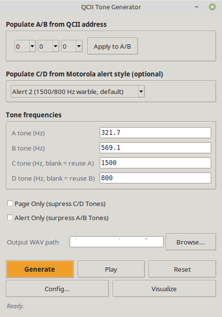
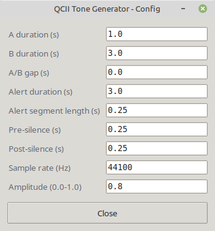
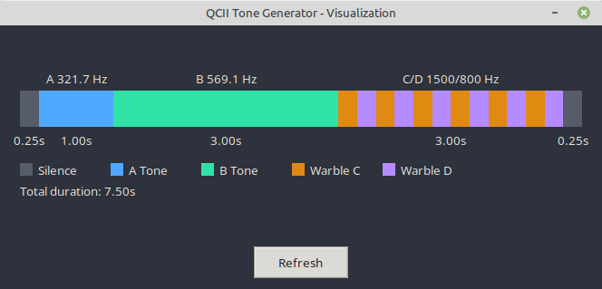

# QCII Tone Generator

Generates WAV files that replicate real-world Motorola Quick Call II (QCII)
paging signals: a sequential two-tone page (A tone, then B tone) optionally
followed by a hi-lo warble alerting tail (the "QC-D" behavior fire dispatch
consoles use to grab attention after the page, before voice traffic starts).

Useful for testing pager/decoder programming — Minitor V, MOTOTRBO QCII
decode, RXC-2000/RDC station alerting boxes, or a DIY tone decoder — by
generating known-good reference audio to play into a radio or feed directly
into decode/DSP software.

## Requirements

- Python 3.9+ (developed/tested on 3.12)
- [numpy](https://numpy.org/) for `qcii_tone_gen.py` and
  `generate_all_pairs.py`:
  ```bash
  pip install numpy
  # or, on distros with an externally-managed Python (e.g. recent Debian/Ubuntu):
  pip install numpy --break-system-packages
  ```
- Tkinter for the GUI (`qcii_gui.py`) — bundled with most Python installs;
  on some Linux distros it's a separate package, e.g.
  `sudo apt install python3-tk`.
- Optional, for in-GUI audio playback: `paplay`, `aplay`, or `ffplay` on
  Linux; macOS and Windows use the OS-provided player automatically.

## Quick start

```bash
# Basic page, no warble tail
python3 scripts/qcii_tone_gen.py --a 321.7 --b 569.1 --warble-dur 0 --out page.wav

# Standard page + warble tail reusing A/B tones (QC-D default behavior)
python3 scripts/qcii_tone_gen.py --a 321.7 --b 569.1 --out page.wav

# Standard page + warble tail using independent C/D tones
python3 scripts/qcii_tone_gen.py --a 321.7 --b 569.1 --c 1500 --d 800 --out page.wav
```

Or launch the desktop GUI:

```bash
python3 scripts/qcii_gui.py
```

## Screenshots

| Main window | Config | Visualize |
|---|---|---|
|  |  |  |

## Scripts

### `scripts/qcii_tone_gen.py`

The core generator. Builds one page as: pre-silence → A tone → optional gap
→ B tone → optional warble tail (C/D tones, or A/B reused if C/D aren't
given) → post-silence, then writes a 16-bit PCM mono WAV. Reach for this
when you have a specific A/B (and optional C/D) tone set to render.

Run `python3 scripts/qcii_tone_gen.py --help` for the full flag list.
Key flags:

| Flag | Meaning | Default |
|---|---|---|
| `--a` / `--b` | Page tone frequencies (Hz) | 321.7 / 569.1 |
| `--c` / `--d` | Independent warble tone frequencies (Hz). If omitted, warble reuses A/B. | none (falls back to A/B) |
| `--a-dur` / `--b-dur` | Page tone durations (s) | 1.0 / 3.0 (standard QCII "1/3") |
| `--gap` | Silence between A and B tones (s) | 0.0 |
| `--warble-dur` | Total warble tail length (s); set to 0 to disable | 3.0 |
| `--warble-seg` | Duration of each hi/lo segment within the warble (s) | 0.25 |
| `--pre-silence` / `--post-silence` | Padding before/after the page (s) | 0.25 / 0.25 |
| `--rate` | Sample rate (Hz) | 44100 |
| `--amplitude` | Peak amplitude, 0.0-1.0 | 0.8 |
| `--out` | Output WAV path | `output/qcii_tone_page.wav` (repo-root output/ folder) |
| `--play` | Play the generated WAV after writing it | off |

### `scripts/generate_all_pairs.py`

Batch-generates QCII page WAVs from the real Motorola Table 1 group-
assignment + tone-position construction (see [Background](#background)
below) — not adjacent tones from the same group's frequency list, which
sit only 8-40 Hz apart and are undecodable in practice. Reach for this when
you want reference audio covering the QCII address space rather than one
specific tone set.

```bash
# 11 samples, one per valid first-digit, using position 2 for A / position 8 for B
python3 scripts/generate_all_pairs.py --mode representative

# every digit2 x digit3 combination for every first-digit
# (11 x 10 x 10 = 1100 files, ~700MB, ~10s to generate)
python3 scripts/generate_all_pairs.py --mode full
```

Both modes accept `--c`/`--d` to give the warble tail an independent tone
pair, same as `qcii_tone_gen.py`. Output is written to `output/` at the
repo root (created automatically). Groups 6, 10, and 11 aren't covered by
either mode — see the Table 3 caveat in `docs/tone_charts.md`.

### `scripts/qcii_gui.py`

A Tkinter desktop front end for `qcii_tone_gen.py`. Lets you set A/B/C/D
frequencies, timing, and output path, then generate and play back the
resulting WAV without touching the command line. Conveniences over the raw
script:

- A 3-digit QCII address (via three dropdowns) can populate the A/B
  frequency fields directly, using the same group/position logic as
  `generate_all_pairs.py`.
- C/D can be populated from a Motorola Centracom "Alert 1/2/3" style
  preset, or left on the default independent warble pair (1500/800 Hz).
- A "Visualize" window draws a timeline of the page that would be
  generated from the current field values, without writing a WAV file.
- Durations, sample rate, and amplitude live in a secondary "Config"
  window, keeping the main window focused on tone selection.

## Building a Windows executable

The GUI can be packaged as a standalone Windows `.exe` with
[PyInstaller](https://pyinstaller.org/):

```bash
pip install pyinstaller
pyinstaller --onefile --windowed --name QCIIToneGenerator scripts/qcii_gui.py
```

`--onefile` bundles the interpreter and dependencies into a single exe;
`--windowed` suppresses the console window since this is a Tkinter GUI app.
The result is written to `dist/QCIIToneGenerator.exe`. A prebuilt copy is
already published at [`Releases/QCIIToneGenerator.exe`](Releases/QCIIToneGenerator.exe)
for anyone who'd rather skip building it themselves.

## Background

QCII ("1+1" signaling) standard timing is A tone for 1s, then B tone for
3s, with no gap ("1/3 timing"). This is the address — a receiving
pager/decoder only unmutes when it hears its exact A/B frequency pair in
that order. QC-D adds an alerting tail after the page — usually an
alternating hi-lo warble — which can either reuse the same A/B tones or
use a completely independent pair (referred to here as C and D).

A 3-digit QCII address maps to an A/B tone pair like this (confirmed
against the worked example on batlabs.com/qcii.html, address 635):

- **Digit 1** selects which Reed tone group tone A comes from and which
  group tone B comes from (Motorola's Table 1 group-assignment plan).
- **Digit 2** selects the tone *position* within tone A's group.
- **Digit 3** selects the tone position within tone B's group.

The full tone charts — Motorola QC1/QC2 Reed groups, the Table 1 group
assignment, the Table 3 extended code plan, and reference tables for other
paging formats (GE Type 99, REACH, Plectron, CTCSS, DTMF, and a per-format
timing table) — are reproduced for offline reference in
[`docs/tone_charts.md`](docs/tone_charts.md).

## Repo layout

```
scripts/                  generator scripts + GUI (see above)
docs/tone_charts.md        offline copy of the source tone charts
docs/Tone-signaling-charts.pdf  original reference sheet
output/                   default write location for generated WAVs (not tracked in git; created on demand)
docs/additional_tone_scripts.md  MODAT, SELCAL, five-tone (Select-5), and TPT generator scripts
```

## License

MIT — see [LICENSE](LICENSE).
